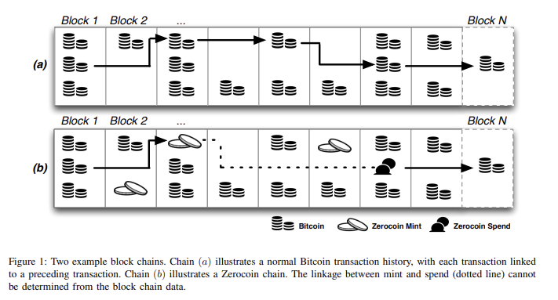

# Zcash

Zcash is a layer 1 blockchain running a fork of Bitcoin. It supports normal transactions like in Bitcoin, called transparent transactions, but adds a layer of privacy that enables execution of transactions where the sender, the receiver and the amount are encrypted before being broadcasted. It uses ZK proofs to ensure consistency of the entire ledger.

## Zerocoin
The development of Zcash has its origins in 2013 in the [paper](https://zerocoin.org/media/pdf/ZerocoinOakland.pdf) "Zerocoin: Anynomous Distributed E-Cash from Bitcoin". In that paper, the authors proposed the first scheme providing user anonymity. There were previous works on that direction, however, Zerocoin was the first one to achieve anonymity without relying on trusted parties. This was previous to all the modern proving systems for arbitrary computations. Therefore, Zerocoin achieves anonymity through the use of zero-knowledge proofs of knowledge designed for particular problems similar to the Schnorr's protocol.

The idea behind Zerocoin was the following. Every user can execute a transaction that would put some bitcoin into a pool of anonymous coins, called *zerocoins*. Later on, the user can spend from this pool without revealing its identity, nor the exact anonymous coin it is using. The magic of zero-knowledge proofs and the clever protocol handles the consistency of the system.

## Zerocash
Zerocoin had several problems. The main one was proof sizes. These were in the order of 45kb, making anonymous transactions too large with slow verification times (450 ms). Another problem is that Zerocoin only supports zerocoins of fixed amount and does not provide means to divide them. 

So, in 2014 the [paper](https://eprint.iacr.org/2014/349.pdf) "Zerocash: Decentralized Anonymous Payments from Bitcoin" was published. It introduces the second generation of these ideas. This time, the proposed protocol achieves privacy and not only anonymity. This means, it hides account balances, transaction amounts and user identities from public view. While doing so, it also improved on every other aspect of Zerocoin: proof sizes were reduced to 1kb, verification times of around 6 ms, anonymous transactions allow variable amounts, and allows direct anonymous payments to a user's address.
Zerocash leverages one of the firsts zk-SNARKS for arbitrary programs called *Pinocchio*.

## Zcash
Zcash is the blockchain that implements the Zerocash [protocol](https://zips.z.cash/protocol/protocol.pdf). Throughout the subsequent years, Zcash evolved following the advances in Zero Knowledge protocols. Different versions of Zcash receive different codenames: Sapling, Sprout, Orchard. The proving systems used were: BCTV14 in Sapling, Groth16 in Sprout, and Halo2 in Orchard. 

# References
- [Zerocoin's paper](https://zerocoin.org/media/pdf/ZerocoinOakland.pdf).
- [Zerocash's paper](https://eprint.iacr.org/2014/349.pdf).
- [Zcash protocol](https://zips.z.cash/protocol/protocol.pdf)

