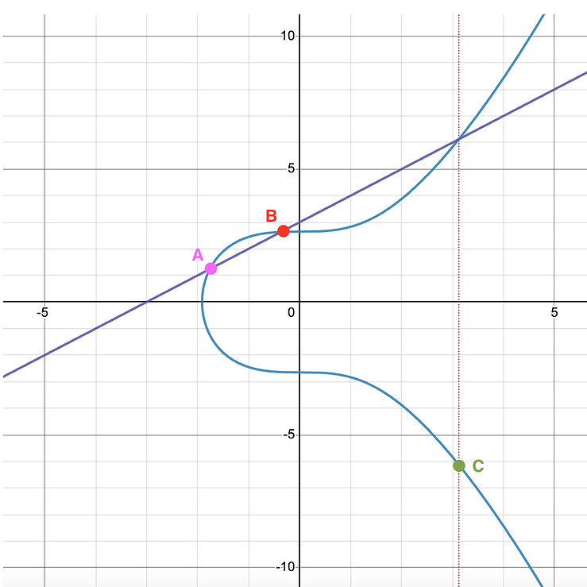

# Elliptic curves
Elliptic curves are defined by two parameters $a, b$. We say a point $(x, y)$ belongs to an elliptic curve if:

$$y^2=x^3+ax+b$$

The good thing about elliptic curves is that you can define an operation $+$ and a neutral element noted $0$. The points of the curve and this operation form a group $\mathbb{G}$. If you take $x,y \in \mathbb{R}$ the addition of points $A$ and $B$ has a geometric interpretation:

The point $C$ is $A+B$. To add two different points, you find the line that crosses the 2 points. Elliptic curves guarantee that this line will intersect the curve at a third point, then reflect that point over the $x$ axis and you get $C=A+B$. The inverse of $C$, noted $-C$ is the reflection we mentioned, the "third point". There are some special cases: when you take a point and its inverse, and when you take the same point twice $P+P$. This cases form a vertical line that doesn't intersect a third point. Here, we say this line intersects with the point at infinity $0$. This point is the neutral element of $\mathbb{G}$.

When adding a point with itself a number of times, we'll use the following notation: $3P=P+P+P$.

## Curves over finite fields
We are interested in curves where $x, y \in \mathbb{F}_p$. We'll note the points in the curve $E(\mathbb{F_p})$. Here, when we plot the points $(x, y)$ for a specific curve, things get more caotic:

This apparent randomness is what makes elliptic curves useful. For certain combinations of $a$, $b$, and $\mathbb{F}_p$, their group $\mathbb{G}$ has a difficult discrete logarithm problem. We've seen in the last section why this is useful.

## Projective coordinates
When we express the coordinates as $(x, y)$, we have to introduce this awkard point $0$ that has no actual coordinates. When implementing the curve operation, this leads to bad performance and coding practices. Most implementations of curve operations use projective coordinates instead. This points are represented by $(x, y, z)$ such that:

$$y^2z=x^3+axz^2+bz^3$$

The operations are adjusted accordingly. Each point $(x, y)$, has infinite representatives in projective coordinates. If you take the one such that $z=1$, you're just using affine coordinates. Now we can represent the element $0$ as any point $(0, y, 0)$.

## Families of curves
The curves defined by the equation we've seen so far are said to be in **Short weierstrass** form. Any elliptic curve can be expressed like this. But there are some more specific families of curves. Some curves can be written in the **Montgomery** form. Some curves can be written in **Edwards** form. This curves have additional properties. This properties allow to code faster operations or have more secure groups.

## Pairing
The points $E(\mathbb{F_p})$ form a group $\mathbb{G}$ of order $q$. That is, with $q$ different points inside it. A pairing is an operation between two points $A, B$, that returns an element in $\mathbb{F_q}$:

$$e(A, B)=t$$

Do not get confused, we have two different finite fields. $\mathbb{F}_p$ is the field where the coordinates of the points live. $\mathbb{F}_q$ is the field where things end up after the pairing, this field has the same order as the group $\mathbb{G}$ of the curve. The pairing has a property called bilinearity:

$$e(xA, yB)=t^{xy}$$

This property is crazy. It states that adding $A$ with itself one more time, is equivalent to multiplying $t$ with itself in $\mathbb{F}_q$ one more time. It mixes two different worlds. The main algorithm for computing pairings is divided in two steps the **Miller loop** and the **final exponentiation**. Most optimizations efforts use properties of specific curves in order to reduce the size of the loop or the exponentiation.

TODO: talk about G1, G2, and field extensions. Maybe do a chapter specific to curves, and keep this more simple.
