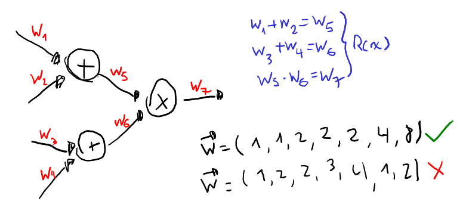

# Arithmetization
The goal of this process is to start thinking about the program mathematically. We can think of a program as having two important things:
- *Memory*: a place to store intermediate steps of its computation. It can be seen as a vector $\vec{w}$ that stores values.
- *Logic*: it can be seen as a system of polynomial constraints $R(x)$, that describe which $\vec{w}$ are valid executions.

Not every memory vector $\vec{x}$ will correspond to the exepcted logic of the program. If the constraints are zero, then the variables in $\vec{w}$ have the relationship determined by the program:

$$R(\vec{w})=0 \iff \vec{w} \text{ follows the expected logic of the program}$$

In zero-knowledge the logic of the program encoded in $R$ is known for both the prover and the verifier, while the content of the variables, encoded in $\vec{w}$ is only known to the prover who has run the computer program.

This looks confusing at first. Let's see examples of how $R$ and $w$ look like. There are two different strategies to intuetivily come up with them.

## Circuits
The first strategy is to think about the program as a "hardware circuit". This circuit has sum and multiplication gates. Each gate has inputs and outputs. For example, a sum gate has two inputs `(x, y)` and one output `(z)`. The sum gate enforces the constraint `x + y == z`. Combining several sum and multiplication gates you end up basically with a complex system of constraints $R(x)$:

To obtain a feasible solution $\vec{w}$ you can compute the circuit gates. A disadvantage is that circuits are **rigid**. If you want to prove different programs (other than `claim_raccoon_coins`), you have to design a different circuit for each of them. Also, using gates is too low-level. There are tools to recycle common circuits called **gadgets**.

## Execution trace
Another strategy is to design a virtual machine. A virtual machine essentially has a set of registers to store values and a set of instructions that describe valid transitions from a state to the following.

> ### Small example
> When executing a VM we obtain a series of states. This sequence of states is what we call an **execution trace**. Here we have the trace of a simple VM that was executed for 3 steps:
> 
> | OP  |  A       | B        | C        |
> | ----| -------- | -------- | -------- |
> |  1  |  1       | 1        | 2        |
> |  0  |  3       | 2        | 8        |
> |  1  |  3       | 0        | 11       |
>
> This machine is very simple. **OP** is a register that stores opcodes. **A** and **B** store operands, and **C** stores the cumulative results (starting at zero). If OP == 1 then A + B is added to C. If OP == 0 then A * B is added to C.
> If we see $op$, $a$, $b$ and $c$ as polynomials such that $$op(\omega^i)=OP_i \ ; \ a(\omega^i)=A_i \ ; \ b(\omega^i)=B_i \ ; \ c(\omega^i)=C_i$$
> over the domain $\omega^i$, then this can be expressed as a system of equations $R(x)$:
>  
> **Boundary constraints**:
> $c(\omega^0)=0$
> 
> **Transition constraints**:
> $c(\omega x) = op(x) * (a(x) + b(x) + c(x)) + (1 - op(x)) * (a(x) * b(x) + c(x))$ 
> 
> $a, b$ and $c$ can be easily obtained through interpolation. Here, the witness $w$ can be $c(x)$.

The advantage of this strategy is **flexibility**. You can code different programs with the VM and they will be accepted. You don't need to design different circuits for different programs. The disadvantage is that you may have **performance overhead** compared to circuits.

## Common practices in constraints
The goal of circuits and execution traces is to intuitively derive the constraints $R(x)$ that describe computation. But, we can add any additional constraints if we find it useful. Here're some frequent practices in proving systems.

### Selectors
An example of a selector is the **OP** column in the execution trace example. Here, a polynomial $op(x)$ "selects" which operation is chosen (add or mul). This type of selector polynomials appear frequently inside constraints.

Example: 
$$
s(x) A + (1-s(x)) B = C
$$

The selector $s(x)$ defines whether $A$ or $B$ will be equal to $C$.,

## Nothing matters
Although this two arithmetization strategies (circuits and execution trace) may seem different, note that in the end both just end up being a system of polynomial constraints $R(x)$. That is good, because we need polynomials for our the next step: the polynomial commitment scheme.

Note: This system of constraints is sometimes called **R1CS** (Rank one constraint system).
